# SMART-Keycloak-eID
The main goal of this project is to create a prototype of a [SMART on FHIR](https://docs.smarthealthit.org) app that uses [Keycloak](https://www.keycloak.org) and [ID Austria](https://www.oesterreich.gv.at/id-austria.html) for authorization and authentication. The app allows patients to securely access their own data in the Electronic Health Record (EHR) system. Keycloak serves as the authorization server, responsible for issuing JWT tokens to the app. It acts as an identity broker, with ID Austria being the identity provider responsible for authentication.

## Background
This project is inspired by the [Health Outcomes Observatory](https://health-outcomes-observatory.eu) (H20) project, which aims to integrate patient-generated data (PRO) into EHR systems. By combining the SMART on FHIR app with Keycloak's authorization server and ID Austria as the identity provider, the project aims to provide patients with a secure and user-friendly way to access health data.

## Architecture (General)
The general architecture of the launch and authorization process with the SMART on FHIR standard looks as follows:

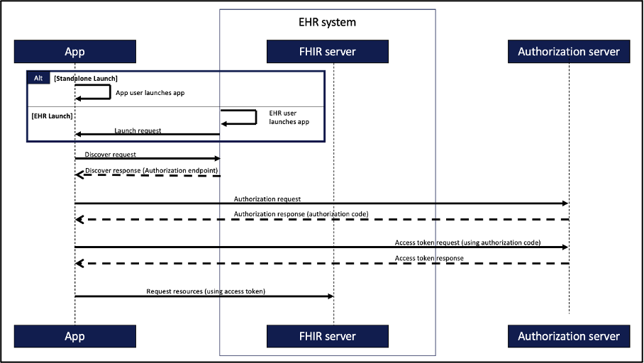

The authentication and authorisation process can be roughly described in seven steps:
1.	Register App with EHR
Registration happens out-of-band prior to any app launch.
2.	Launch app:
This step needs to be differentiated into two distinct scenarios:
•	Standalone launch
In this scenario, the app is launched outside the EHR, for example by opening an app on a smartphone.
•	EHR launch
Here, the app is launched and opened within the EHR. The advantage of this approach is that the existing session within the EHR can be used for further authentication.
3.	Discover request
The application automatically searches for the EHR system's SMART configuration file to obtain important information and Uniform Resource Locators (URL) such as the authorisation server endpoint.
4.	Authorization request
The application will then contact the authorisation server and, if successful, will be issued with a temporary authorisation code after successful authentication. 
5.	Access token request
If successful, the application will contact the authorisation server again to exchange the authorisation code for an access token to gain access to the FHIR server.
6.	Request resources
The access token is signed, contains information about the rights granted and can be reliably verified by the FHIR API. As a result, it can be used to request resources from the FHIR server.
7.	Refresh access token
The validity of the access token is limited. To continue accessing FHIR resources, the application needs to update the token.

Note: A central component of the SMART on FHIR standard is authorization and authentication. For this, the SMART on FHIR standards builds on the oAuth2.0 and Open-ID Connect standard. In-Depth details can be found [here](https://build.fhir.org/ig/HL7/smart-app-launch/app-launch.html#launch-app-standalone-launch). 

## Architecture (Prototype)
For the prototype, the general architecture has to be adapted a little. Firstly, the prototype is a standalone SMART on FHIR app. In other words, an app that is not launched from the EHR system. This is because the app is later designed for patients to capture PRO data, which is not handled by an EHR system but by a standalone app. Secondly, another component is added to the prototype architecture, namely ID Austria as the identity provider. Keylcoak serves as an identity broker between the app and the identity provider. Besides that, the authorisation and authentication process is almost the same as in the 7 steps described above. The architecture of the prototype can be seen in the next figure.

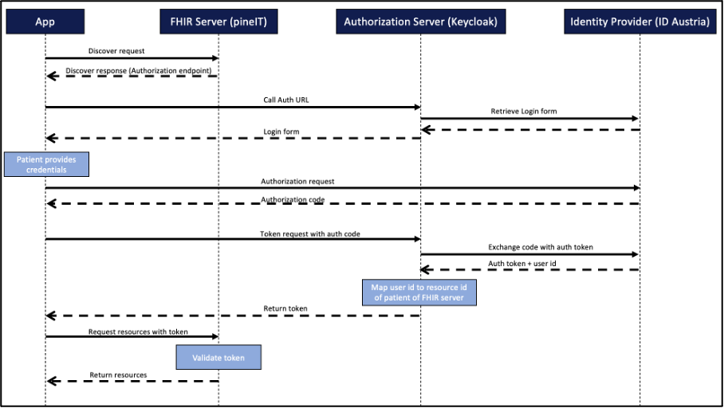

Notes on the components and the current state of development:
- the FHIR server is provided by the company [pineIT](https://www.pineit.at) for this project. Due to CORS restrictions on the server side, relevant server endpoints are simulated on a local environment (localhost). The validation of the tokens is therefore not possible in the first step, and must be carried out as soon as the SMART on FHIR app is running under the same domain as the FHIR server in order to circumvent the CORS restrictions.
- Currently, the access data to ID Austria is still missing, which is why GitHub is being used as the identity provider for the time being.

# Environemnt Setup
As mentioned, the setup is just a setup for a local environment (localhost). For further developments, the components must run publicly. The local development environment looks as follows:

- OS: Ubuntu v22.04.2 LTS
- Docker: v24.0.2
- Node: v20.2.0

To reproduce the setup, make sure these components are working.

## FHIR Mock
The FHIR server has two primary tasks. Firstly, it serves the smart-configuration file, which is accessible at /.well-known/smart-configuration. This file contains the endpoints of the authorization server. When the app contacts the FHIR server, it is directed to this file. By extracting the relevant information from the smart-configuration file, the app can establish communication with the authorization server. Secondly, the FHIR server is responsible for validating the JWT token issued by the authorization server. The app receives the JWT token from the authorization server and utilizes it to request FHIR resources through the FHIR server. However, the validation step cannot be performed in the local setup since the FHIR server is only simulated locally, limiting its capability to validate the token. Consequently, the validation process must be conducted and tested in a public environment at a later stage.

To simulate the /.well-known/smart-configuration endpoint, perform the following steps:

1. Navigate to your Home directory:
```
cd ~
```

2. Create a new directory:
```
mkdir fake-fhir
```

3. Change into the newly created directory:
```
cd fake-fhir
```

4. Initialize a new NPM project. Keep the default configurations and specify a project name such as fake-fhir:
```
npm init
```

5. Install the http-server with NPM:
```
npm install http-server
```

6. Create a new file server.js with a text editor of your choice, for example nano:
```
nano server.js
```

7. Insert the following code into the server.js file: 
```
const http = require('http');

const server = http.createServer((req, res) => {
  if (req.url === '/fhir/') {
    res.writeHead(200, { 'Content-Type': 'text/plain' });
    res.end('Hello World');
  } else if (req.url === '/fhir/.well-known/smart-configuration') {
    const json = JSON.stringify({
      issuer: 'http://localhost:8081/fhir/',
      jwks_uri: 'http://localhost:8082/realms/myrealm/protocol/openid-connect/certs',
      authorization_endpoint: 'http://localhost:8082/realms/myrealm/protocol/openid-connect/auth',
      grant_types_supported: ['authorization_code'],
      token_endpoint: 'http://localhost:8082/realms/myrealm/protocol/openid-connect/token',
      token_endpoint_auth_methods_supported: [
        'private_key_jwt',
        'client_secret_basic',
        'client_secret_post',
        'tls_client_auth',
        'client_secret_jwt'
      ],
      scopes_supported: [
        'openid',
        'launch',
        'launch/patient',
        'patient/*.cruds',
        'offline_access'
      ],
      response_types_supported: ['code'],
      introspection_endpoint: 'http://localhost:8082/realms/myrealm/protocol/openid-connect/token/introspect',
      capabilities: [
        'launch-standalone',
        'client-public',
        'context-standalone-patient',
        'permission-patient',
        'sso-openid-connect'
      ],
      code_challenge_methods_supported: ['S256']
    });

    res.writeHead(200, { 'Content-Type': 'application/json' });
    res.end(json);
  } else {
    res.writeHead(404);
    res.end();
  }
});

server.listen(8081, () => {
  console.log('Server running on http://localhost:8081/');
});

```
The JSON file can also be found in the FHIR-Mock folder.

8. Save the file.

9. Start the server with Node.js:
```
node server.js
```

10. Check the results by visiting the following link in your web browser:
```
http://localhost:8081/fhir/.well-known/smart-configuration
```

## SMART Standalone App

The next component is the SMART on FHIR App. The app is designed to work from a web browser. Users (or later, patients) can initiate the login process from there.

SMART provides a [library](http://docs.smarthealthit.org/client-js/) for this purpose. The library offers three important components:

1. oauth2.authorize() - This method accepts important parameters such as the Client ID (which must match the client created in Keycloak) and the FHIR server endpoint. The method retrieves information about the authorization server endpoints (smart-configuration) from the FHIR server. The required scopes are also specified here.
2. ready() - Once the authorization and authentication process is complete, the app receives the corresponding JWT tokens in the HTML body. The ready() method uses this token to create a client object.
3. The client object can then be used to query FHIR resources from the FHIR server. The FHIR server is responsible for validating the JWT token.

The following instructions describe how to set up this app. Please note that the ready() method and the client object have not been tested yet, as the FHIR server is currently only a mock. Also, remember to adjust the parameters in the oauth2.authorize() method to match the correct FHIR server later.


1. Clone this repository by running the following command in your terminal:
```
git clone https://github.com/larsgrespan/SMART-Keycloak-eID.git 
```

2. Change into the /SMART-App directory within the cloned repository:
```
cd SMART-Keycloak-eID/SMART-App
```

3. Install the http-server module with NPM:
```
npm install http-server
```

4. Start the application by running the http-server command:
```
http-server
```

5. Download the CORS Everywhere browser extension.

6. Ensure the CORS Everywhere (or equivalent) extension is activated in your browser when you start the application.

7. Open your browser and navigate to the following URL:
```
http://localhost:8080/launch.html
```

Note: Avoid opening index.html first, as this can lead to errors.

8. To initiate the login process you can click the login button. However the authorization server is not configured yet, so it will lead to errors. When you finished the Keylocak setup, you can try the login process. Note that you may delete cookies after an login.

## Keycloak

The last component is Keycloak. Keycloak serves as the authorization server connected to the identity provider. Currently, GitHub is being used, but later it will be ID Austria.

When a client app successfully authenticates with Keycloak, Keycloak issues a JWT token to the app. This token allows the app to query FHIR resources. To ensure that the JWT token is recognized as valid by the FHIR server, certain configurations need to be made in Keycloak to include relevant information in the token.

These configurations include:

1. The Keycloak server needs to ensure that the JWT token includes an Audience parameter. This parameter is checked to prevent fake servers from obtaining a JWT token that can be used to request resources from legitimate FHIR servers. The Audience parameter serves as a security measure. To achieve this, a Keycloak extension exists, but we encountered difficulties deploying it in a public Keycloak environment. Therefore, a temporary alternative was sought, which involved hard-coding the Audience parameter into the JWT token via the scopes, as described in the present documentation.

2. The Keycloak server is also responsible for checking the scopes and returning the scopes along with the JWT token. It verifies whether the client is authorized to request the scopes. The allowed scopes are stored in Keycloak and are validated accordingly. If a client requests scopes that are not defined in Keycloak, the authentication process is aborted.

3. The Keycloak server needs to ensure that the JWT token includes a patient_id that corresponds to the patient_id stored in the FHIR server. This allows the app to request the relevant FHIR resources associated with that patient_id. To achieve this, a mapping is required. However, mapping itself is a complex project and is not covered in the current project. In this documentation, the patient_id is also hard-coded, similar to the audience parameter.

To configure the Keycloak server, follow the next steps. The following configurations outline the tasks that the Keycloak server needs to fulfill: 


1. Run Keycloak using Docker with the following command:
```
docker run -p 8082:8080 -e KEYCLOAK_ADMIN=admin -e KEYCLOAK_ADMIN_PASSWORD=admin quay.io/keycloak/keycloak:22.0.0 start-dev
```
Note: Keycloak version 22.0.0 was used in this project.

2. Create a realm (e.g., "myrealm") in Keycloak.


3. Click on "clients" and create a new client.
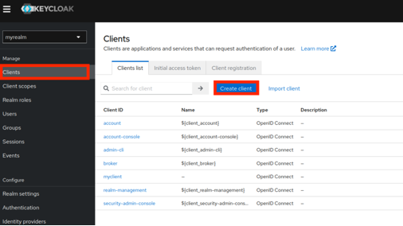

4. Ensure "OpenID Connect" is selected, specify a client id (e.g., "myclient") and click next.
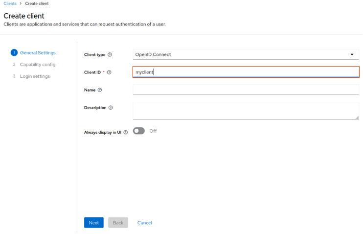
Note: The client id has to be the same as specified in the SMART app.

5. For capability config, keep the default configuration and click next.

6. In "Login settings", specify a “*” for "Valid redirect URIs" and "Web origins", then click save.
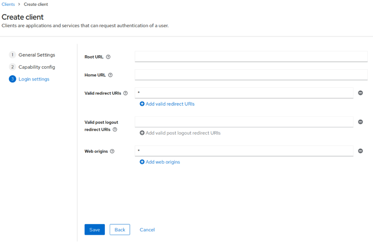
Note: This setting is only for development purposes. It should be adapted for a production environment.

7. After creating your client, scroll down to "Login settings".

8. In this section, select "keycloak" as the Login Theme, enable "Consent required", and enable "Display client on screen" (if you wish), then click save.

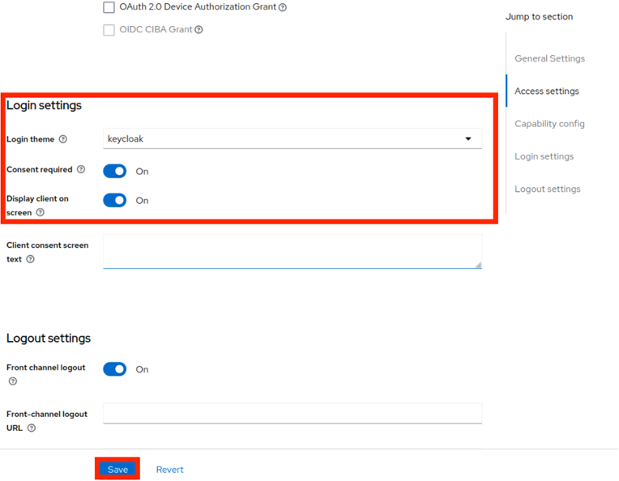

9. Scroll back to the top and navigate to the "Advanced" section. On the right side, jump to "Advanced Settings". 
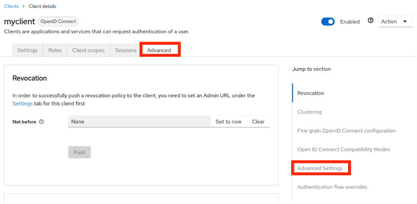

10. Select "S256" for "Proof Key for Code Exchange Code Challenge Method (PKCE)", then save the changes.
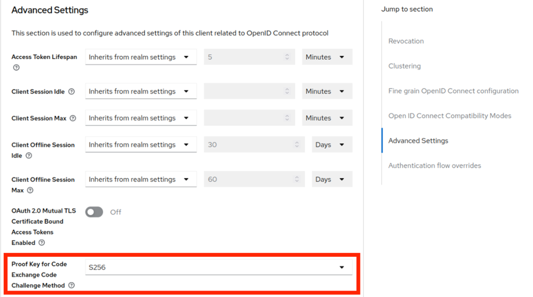
Note: This step might be automatically done through the client request.

11. After this, open the "Client scopes" section.
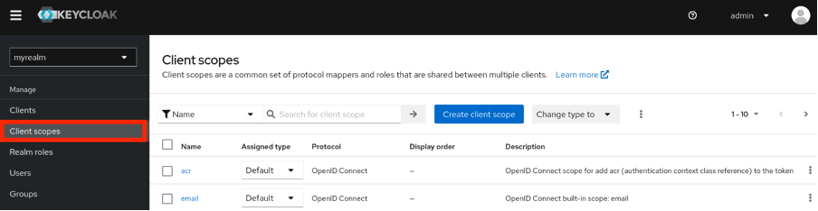

12. Create the scopes specified in the parameters of your oauth2.authorize() method in your SMART on FHIR app (in our case: openid, launch, launch/patient, patient/*.cruds, offline_access).

13. Click "Create client scope".

14. Specify the name of the client scope (e.g., "openid") and select "Optional" for the type. Keep the default for other parameters and click "Save".
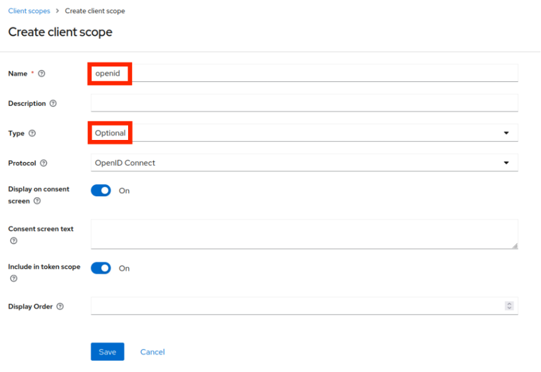

15. Repeat this process for all other scopes.

16. Once all scopes have been created, you need to create mappers to include the aud parameter in your token. To do this, open the scopes (in this case, "openid").
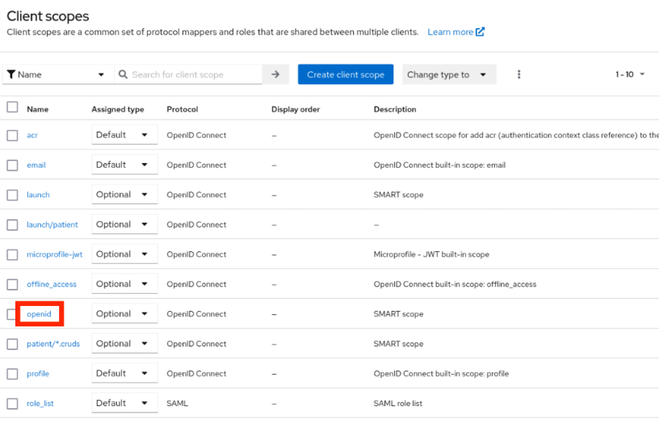

17. Open "Mappers", and click "Add mapper". Then, select "By configuration".
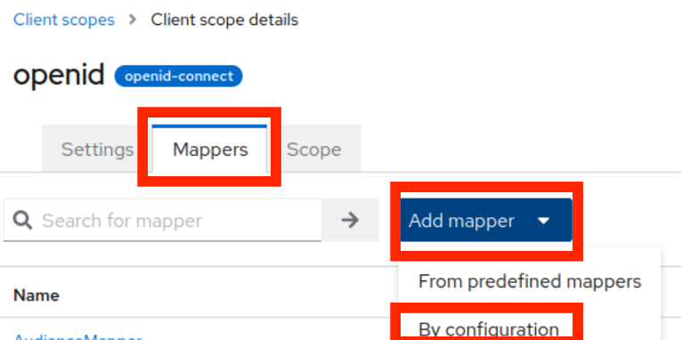

18. Select the "Audience" mapper.
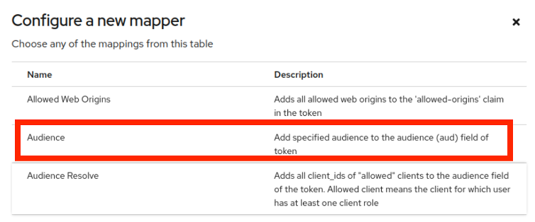

19. Specify a name for the mapper and include the FHIR Server URL in the "Included Custom Audience" field. Then click "Save".
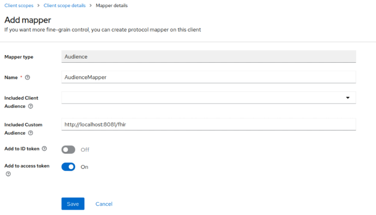

20. Repeat this process for all created scopes.

21. After this, open your created client again. Go to the "Client scope" section. Add all your created client scopes to your client. Ensure the "Assigned" type is set to "optional".
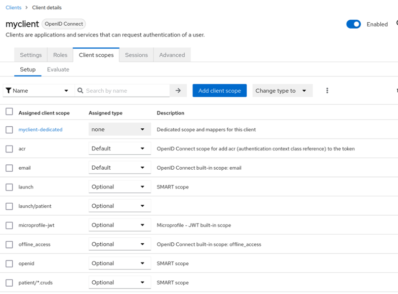

22. Add GitHub as an External Identity Provider. For this, follow the instructions from this [video](https://www.youtube.com/watch?v=P8lpE9nV_Sw).

23. After this, you should be able to login and get an access token. To include the patient_id, an external identity user has to log in first. To do this, start your SMART on FHIR app and log in via GitHub once. (Follow the instructions in the SMART Standalone App part before. Make sure the CORS Webbrowser extension is running). After login, delete the cookies and open Keycloak again.

24. Open the "User" section. There, you should see a user now.
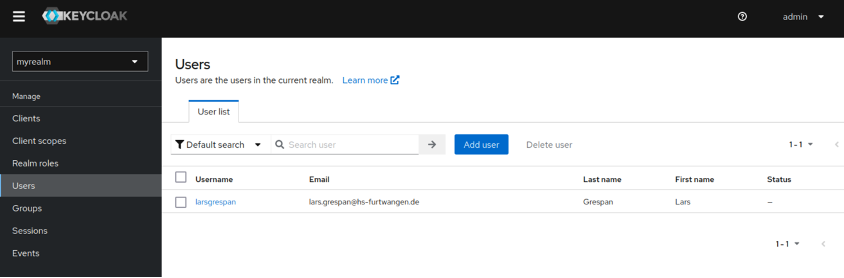

25. Open this user, click on the "Attributes" section and "Add an attribute".
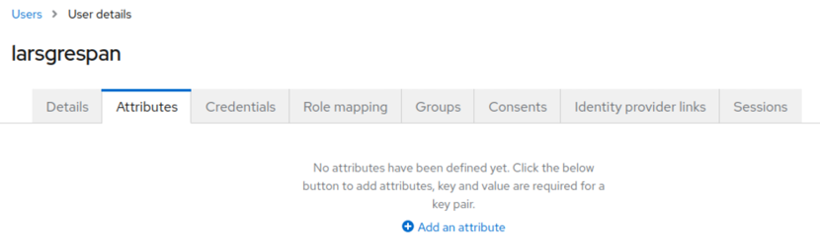

26. As key, specify resourceID. As value, specify Patient0000. Then click "Save".
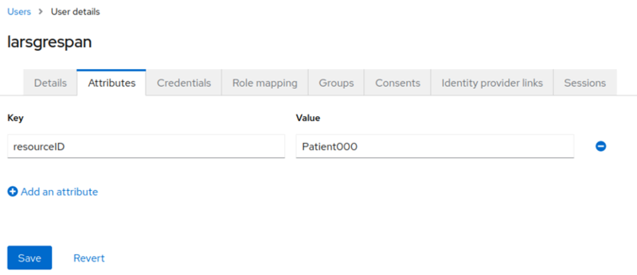
Note: Later, you need to adapt the value to the corresponding patient_id in your FHIR server.

27. Open the "Client scopes" section again and open the scope launch/patient.
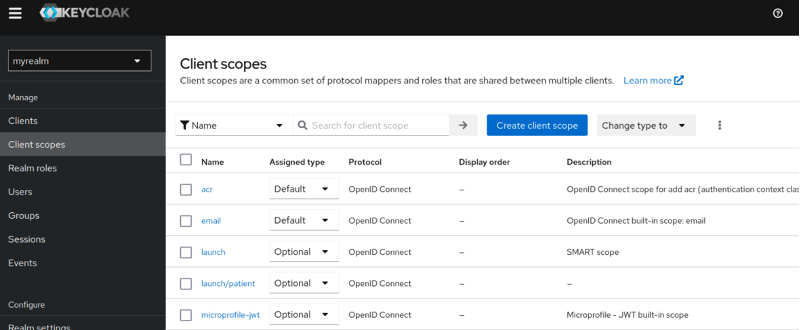

28. Add a second mapper for this specific scope. 


29. Select "User Attribute".
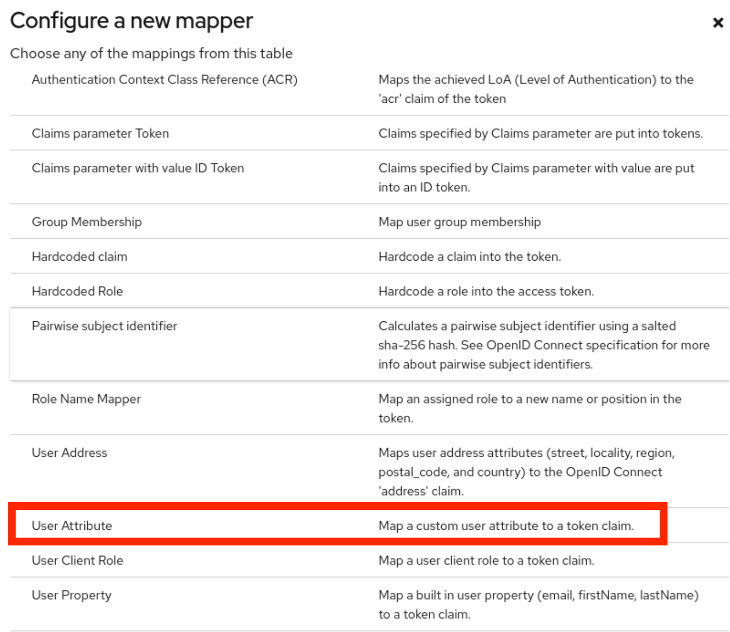

30. Specify a name for the mapper. For "User Attribute", specify resourceID. For "Token Claim Name", specify patient_id. Save the changes.
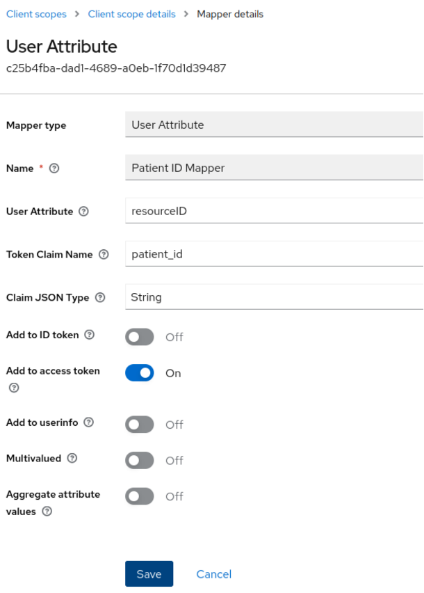

31. If necessary: Go to the "User" section again. Open your user. Go to the "Consent" section and "Revoke" the consent.
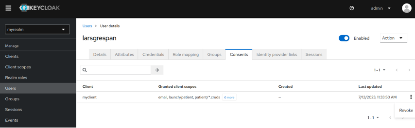

32. Now, you can login with the app again and get an Access Token with patient_id included.

