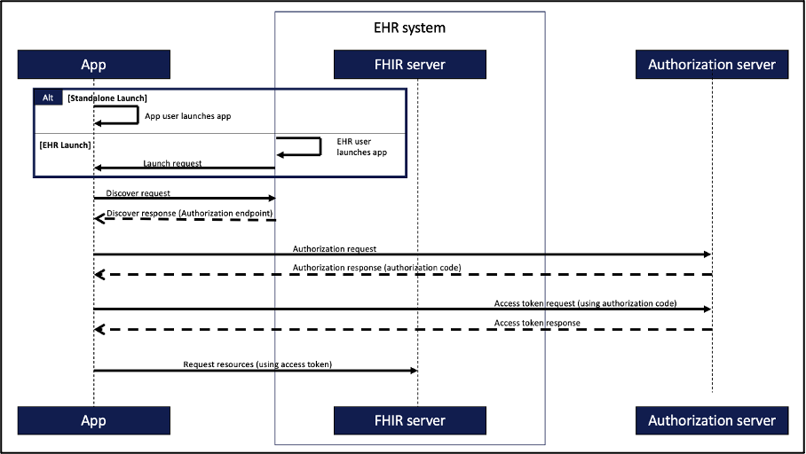

# SMART-Keycloak-eID
The main goal of this project is to create a prototype of a SMART on FHIR app that uses Keycloak and ID Austria for authorization and authentication. The app allows patients to securely access their own data in the Electronic Health Record (EHR) system. Keycloak serves as the authorization server, responsible for issuing JWT tokens to the app. It acts as an identity broker, with ID Austria being the identity provider responsible for authentication.

## Background
This project is inspired by the Health Outcomes Observatory (H20) project, which aims to integrate patient-generated data (PRO) into EHR systems. By combining the SMART on FHIR app with Keycloak's authorization server and ID Austria as the identity provider, the project aims to provide patients with a secure and user-friendly way to access their health data.

## Architecture (General)
The general architecture of the launch and authorization process in SMART on FHIR is as follows:

The authentication and authorisation process can be roughly described in seven steps:
1.	Register App with EHR
Registration happens out-of-band prior to any app launch.
2.	Launch app:
This step needs to be differentiated into two distinct scenarios:
•	Standalone launch
In this scenario, the app is launched outside the EHR, for example by opening an app on a smartphone.
•	EHR launch
Here, the app is launched and opened within the EHR. The advantage of this approach is that the existing session within the EHR can be used for further authentication.
3.	Discover request
The application automatically searches for the EHR system's SMART configuration file to obtain important information and Uniform Resource Locators (URL) such as the authorisation server endpoint.
4.	Authorization request
The application will then contact the authorisation server and, if successful, will be issued with a temporary authorisation code after successful authentication. 
5.	Access token request
If successful, the application will contact the authorisation server again to exchange the authorisation code for an access token to gain access to the FHIR server.
6.	Request resources
The access token is signed, contains information about the rights granted and can be reliably verified by the FHIR API. As a result, it can be used to request resources from the FHIR server.
7.	Refresh access token
The validity of the access token is limited. To continue accessing FHIR resources, the application needs to update the token.

In-Depth details can be found [here] (https://build.fhir.org/ig/HL7/smart-app-launch/app-launch.html#launch-app-standalone-launch). 
